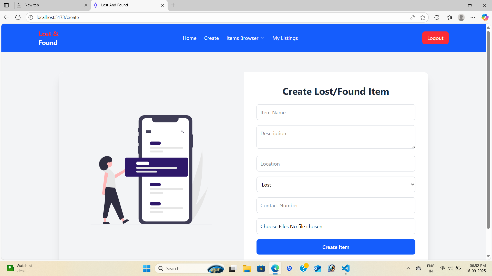
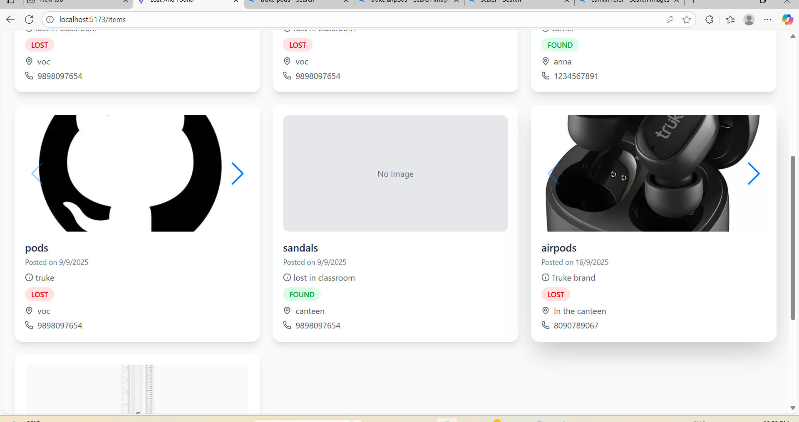
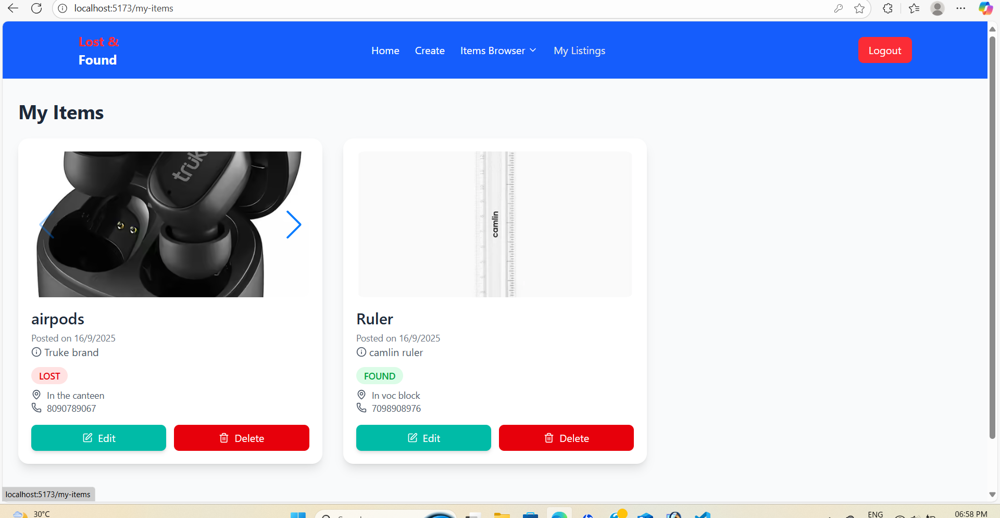

# Lost and Found Web Application

Helps college students report lost items and notify others when items are found.
Includes features like item listings, image uploads, and browsing through reported items.
Built using the MERN Stack (MongoDB, Express.js, React.js, Node.js).

---

# Features

**Report Lost Items:** Students can report lost items with details and images.

**Notify Found Items:** Users can mark items as found and notify the owner.

**Browse Items:** Easy-to-use interface to browse all lost and found items.

**Image Uploads:** Attach images to item listings for better identification.

**Responsive Design:** Works on both desktop and mobile devices.

---

#  TECH STACK

- **Frontend:** React.js, React Router, Tailwind CSS, Lucide Icons  
- **Backend:** Node.js, Express.js, JWT Authentication  
- **Database:** MongoDB with Mongoose  
- **Tools & Libraries:** Axios, Swiper.js, react-hot-toast, VS Code

---

# SCREENSHOTS

**Signup page:**  

  

**Add New Item:**  

  


**All Items:**  

  

**My Items:**

 

---

# INSTALLATION:

1. **Clone the repository:**  
```bash
git clone https://github.com/deepthi566/LostNFound.git
```

---

2. **Navigate to the project folder:**
```bash
cd lost-and-found
```

---

3.**Install backend dependencies:**
```bash
npm install
```

---

4.**Navigate to the frontend folder and install dependencies:**
```bash
cd frontend
npm install
```

---

5.**Run the backend server:**
```bash
npm start
```

---

6.**Run the frontend server:**
```bash
npm start
```

---

# Usage

Navigate to http://localhost:5000 in your browser.

Register or log in to report lost items.

Browse items reported by others and mark them as found if applicable.

---

# Folder Structure

lost-and-found/

├── frontend/    

├── server/ 

├── screenshots/ 

├── package.json

└── README.md


# Future Enhancements

Email or SMS notifications when items are reported found.

Advanced search and filter functionality.

User authentication with role-based access.

Admin panel to manage listings.


