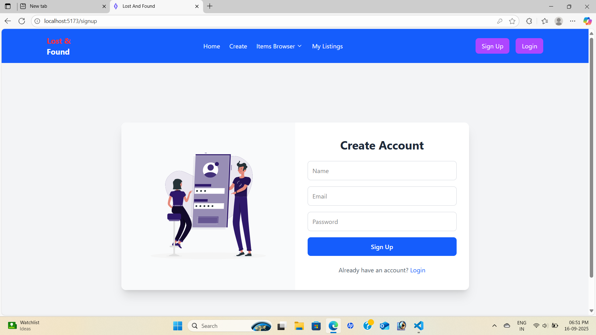

# Lost and Found Web Application

Helps college students report lost items and notify others when items are found.
Includes features like item listings, image uploads, and browsing through reported items.
Built using the MERN Stack (MongoDB, Express.js, React.js, Node.js).

---

# Features

**Report Lost Items:** Students can report lost items with details and images.

**Notify Found Items:** Users can mark items as found and notify the owner.

**Browse Items:** Easy-to-use interface to browse all lost and found items.

**Image Uploads:** Attach images to item listings for better identification.

**Responsive Design:** Works on both desktop and mobile devices.

---

#  TECH STACK

- **Frontend:** React.js, React Router, Tailwind CSS, Lucide Icons  
- **Backend:** Node.js, Express.js, JWT Authentication  
- **Database:** MongoDB with Mongoose  
- **Tools & Libraries:** Axios, Swiper.js, react-hot-toast, VS Code

---

# SCREENSHOTS

**Signup page:**  

  

**Add New Item:**  

  

**All Items:**  

  

**My Items:**

 

---

